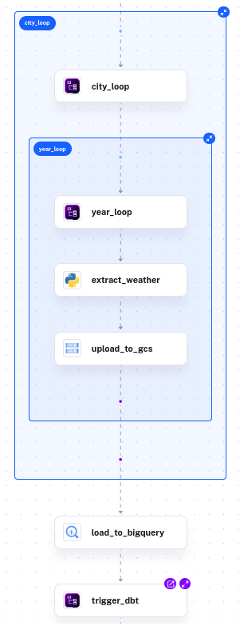
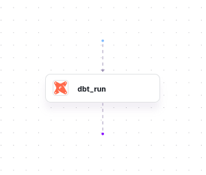
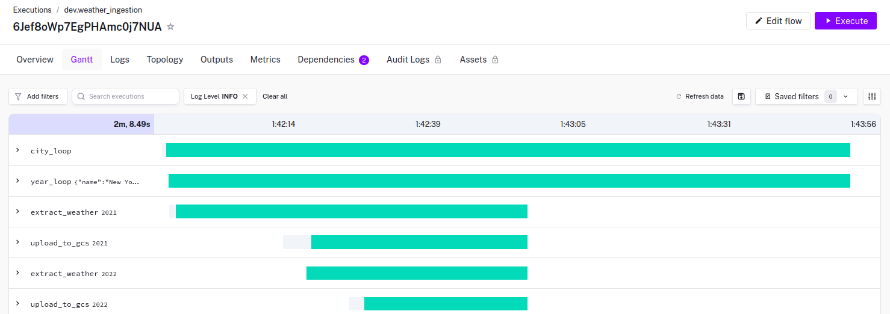
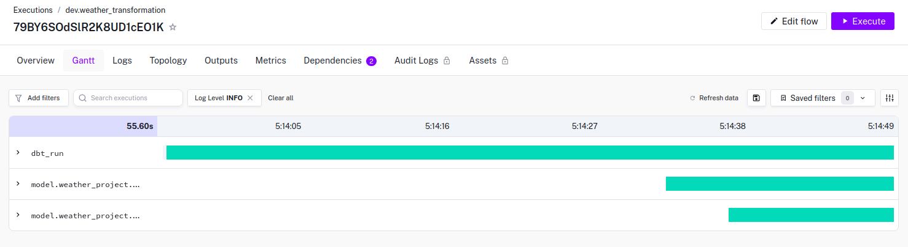
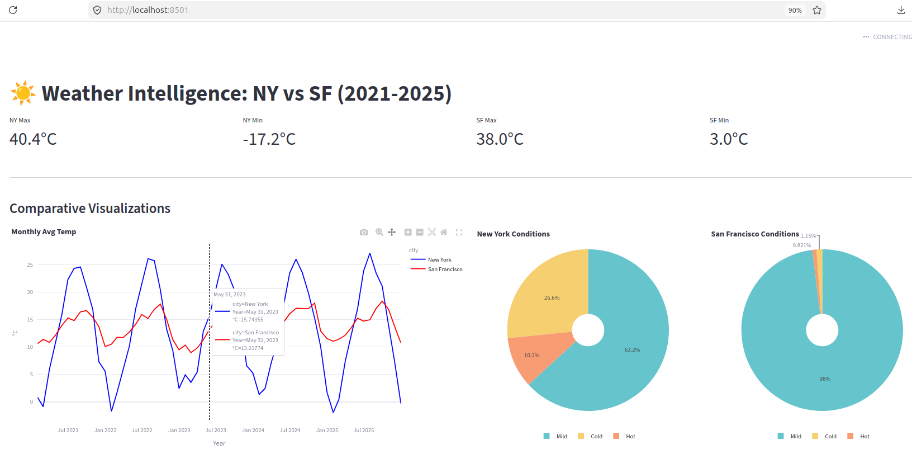

# Historical Weather Intelligence Data Pipeline and Dashboard for NY and SF (2021-2025)


## PROBLEM STATEMENT
Analyzing long-term climate patterns for major coastal metropolitan centers, New York and San Francisco ("NY" and "SF"), requires a robust and scalable data pipeline. This project focuses on gathering and processing 5 years of daily historical weather data in batches for New York and San Francisco to enable comparative analysis of weather patterns and climate trends.


### DATA SOURCE 
https://open-meteo.com/


## TOOLS USED
| Component | Technology | Role in the Pipeline |
| :--- | :--- | :--- |
| **Orchestration** | **Kestra** | Automates batch processing, storage in data lake, transfer to warehouse, gold standard transformation of datasets  |
| **Cloud**	| **Google Cloud Services** |	Cloud platform and resource utilization for data lake and data warehouse |
| **IaC**	| **gcloud CLI / Terraform** |	Provisioning and managing cloud resources |
| **Batch Processing** | **Kestra python containers** | Fetches batches of data from API for NY and SF 5 years(2021-2025) |
| **Data Lake** | **Google Cloud Storage** | Acts as the landing zone for raw data --> scalable and durable |
| **Data Warehouse** | **BigQuery** | Clusters and Partitions the raw data and also perform large-scale historical queries. |
| **Transformation** | **dbt** | Models, Transforms and Cleans the raw API data into analytics-ready tables directly within the warehouse |
| **Visualization** | **Streamlit** | Delivers a final dashboard for side-by-side comparison of weather patterns between New York and San Francisco between 2021-2025 |
| **Environment** |	**uv**	 | Python package and dependencies management for local development and reproducibility |

### DATA PIPELINE WORKFLOW
* **Ingestion (End-to-End Batch Orchestration using Kestra)**

    * Managed via Kestra, the pipeline runs a Python-based task that:

        * Fetches historical data for NY and SF from 2021 to 2025.

        * Stages the raw data in Google Cloud Storage (GCS) as Parquet/CSV.

        * Loads data into BigQuery raw landing tables.

* **Data Warehouse Optimization (BigQuery)**

    * **Partitioning**: 
        * Data in BigQuery is partitioned by date to optimize query performance and reduce costs for time-series analysis. Yearly Partitioning was done because my dataset is small and grows by year. Using DAY partitioning for only 2 years of data would create too many small files, which can actually degrade performance. 

    * **Clustering**: 
        * Tables are clustered by city to speed up the NY vs. SF comparison filters. Clustering by City within each year ensures that queries filtering for a specific city remain highly efficient. This is done to make sure the transformations can be quickly done to convert data ready for the analytics dashboard.


* **Transformations (dbt)**

    * Using the dbt-bigquery adapter, the raw data is transformed into **two analytics-ready models**:

        * **weather_metrics**: Daily grain data with calculated temperature averages and weather categories (Hot/Mild/Cold).

        * **weather_summary**: Yearly aggregates for high-level trends.

* **Dashboard (Streamlit)**

    * An interactive dashboard displaying **3 different tile groups**:

        * **Top Level Metrics**: Extremes (Max/Min) for both cities across the 5-year window.

        * **Temporal Line Graph**: Overlaid monthly average temperatures to visualize seasonal variance.

        * **Categorical Distribution**: Side-by-side  2x Pie Charts showing the proportion of weather types per city.

# IMAGES
* weather_ingestion and weather_transformation flows:



* weather_ingestion and weather_transformation flow execution gantt charts:



* streamlit dashboard serving:


# SETUP FOR REPRODUCING THE OUTPUT:

## Local environment
###  Approximate Project Structure

```text
project/
├── README.md                 # Project documentation and setup guide
├── pyproject.toml            # uv configuration and Python dependencies
├── docker-compose.yml        # Local Kestra and database orchestration
├── .gitignore                # Security: Blocks secrets and environment files
│
├── dashboard/                
│   └── weather_dash.py       # Streamlit application code
│
├── kestra_gcs_bigquery_dbt/  
│   ├── weather_ingestion.yaml      # Pipeline: Fetch data -> GCS -> BigQuery
│   └── weather_transformation.yaml # Pipeline: Runs dbt models in BigQuery
│
└── terraform/                
    ├── main.tf               # Infrastructure: GCS Buckets & BigQuery Datasets
    └── variables.tf          # Configurable GCP variables
```

* Copy over the files under /project OR Clone the project folder of the repo 
* create your .env file:
    `touch .env`
* Edit .env with your GCP_PROJECT and absolute path to your `google_cloud_platform_service_account_key.json`

## Google cloud platform in local
* use a service account, generate key and use it for terraform
* or login as follows using the cli and ui in browser:
`gcloud auth login`
`gcloud auth application-default login`

* make sure to logout once completed using the folowing two commands
`gcloud auth application-default revoke`
`gcloud auth revoke`

## Terraform
* created main.tf and variables.tf
* Run the terraform commands from /terraform directory
* `terraform init` to initialize the necessary resources
* `terraform fmt` to prettify the .tf files
* `terraform plan` to validate the config  
* `terraform apply` to apply the config in the GCP
* make sure to run `terraform destroy` upon completion. 
* Execute the terraform commands ONLY inside the /terraform directory

## Docker + Kestra --> (GCS + BigQuery + dbt)
* If you use Kestra free version: create a .env file with your own **GCP credentials in base64** 
    * `echo -n "SECRET_###=$(base64 -w 0 ~/###/###/###/google_cloud_platform_service_account_key.json)" >> .env`
* Run the docker commands from /project 
* `docker compose up -d` to build the image and get the containers running in detached mode
* `docker ps` to check if the containers are up and running
* access the Kestra UI from `localhost:8080` and login using credentials mentioned in docker compose yml file
* If you use Kestra paid version: set the GCP credentials inside secrets in kestra UI (remove env vars inside ocker compose yml and set it in Kestra UI after running docker compose)
* Import the flows located in the /kestra folder into your Kestra instance.
    * `weather_ingestion.yaml` (includes fetching the API, batch processing, upload to google cloud storage, transfer and optimize in BigQuery)
    * `weather_transformation.yaml` (includes fetching raw table from BigQuery, process and transform using dbt, store analytics ready table in BigQuery )
* Execute the weather_ingestion flow in Kestra --> it  will auto trigger the weather_transformation flow
* Check for the changes made from your Google Cloud Service account
* Upon completion make sure to remove the docker resources 
    * `docker stop $(docker ps -aq)`
    * `docker system prune -a --volumes`

## Dashboard (Streamlit)
* Launch Dashboard from /project 
    * `uv run --env-file .env streamlit run dashboard/app.py`
* `localhost:<available port>` will host the streamlit dashboard
* once you are done, **ctrl+C** to stop hosting the dashboard


# SPECIAL NOTE
* Thanks to all the instructors and datatalks.club